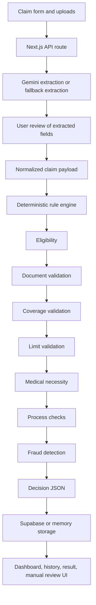

# Architecture



## System Boundaries

- `src/app` contains the Next.js App Router pages and API routes.
- `src/components` contains shared UI components and small presentation helpers.
- `server/extraction` contains the Gemini adapter and deterministic fallback extraction.
- `server/rules` contains the deterministic adjudication engine.
- `server/storage` abstracts Supabase persistence and in-memory fallback storage.
- `data` contains runtime policy terms and official test scenarios.
- `supabase/schema.sql` contains the production persistence schema.

## AI Boundary

Gemini is constrained to OCR, document understanding, field extraction, and extraction confidence. It never approves, rejects, or prices a claim. The final decision is made by `server/rules/adjudicator.ts`.

## Rule Modules

The adjudicator executes modular rule files in this order:

1. `server/rules/eligibility.ts`
2. `server/rules/documentValidation.ts`
3. `server/rules/coverageValidation.ts`
4. `server/rules/limitsValidation.ts`
5. `server/rules/medicalNecessity.ts`
6. `server/rules/processValidation.ts`
7. `server/rules/fraudDetection.ts`
8. `server/rules/adjudicator.ts`

## Decision Shape

Every adjudication result includes:

```json
{
  "claim_id": "CLM_XXXXX",
  "decision": "APPROVED",
  "approved_amount": 0,
  "rejection_reasons": [],
  "confidence_score": 0.95,
  "notes": "Additional observations",
  "next_steps": "What the claimant should do"
}
```

The application also stores extracted fields, uploaded document metadata, deductions, rule explanations, fraud flags, manual-review metadata, and audit events for reviewer visibility.

## Storage

When `SUPABASE_URL` and `SUPABASE_SERVICE_ROLE_KEY` are configured and the schema exists, data is persisted to Supabase. Without Supabase credentials, or when the schema is missing during local evaluation, the app falls back to in-memory storage for the current server session.
