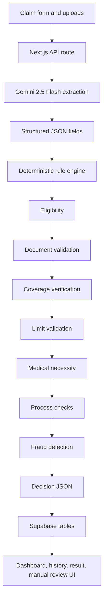

# Architecture



Gemini is constrained to OCR, document understanding, field extraction, and extraction confidence. It never returns or influences the final claim decision directly. The final decision is made by `server/rules/adjudicator.ts`, which executes modular rule files in the order required by `assignment/adjudication_rules.md`.

## Rule Modules

- `server/rules/eligibility.ts`
- `server/rules/documentValidation.ts`
- `server/rules/coverageValidation.ts`
- `server/rules/limitsValidation.ts`
- `server/rules/medicalNecessity.ts`
- `server/rules/processValidation.ts`
- `server/rules/fraudDetection.ts`
- `server/rules/adjudicator.ts`

## Decision Shape

Every adjudication returns:

```json
{
  "claim_id": "CLM_XXXXX",
  "decision": "APPROVED",
  "approved_amount": 0,
  "rejection_reasons": [],
  "confidence_score": 0.95,
  "notes": "Additional observations",
  "next_steps": "What the claimant should do"
}
```

The application also stores extraction details, deductions, rule explanations, fraud flags, and audit events for operational visibility.
